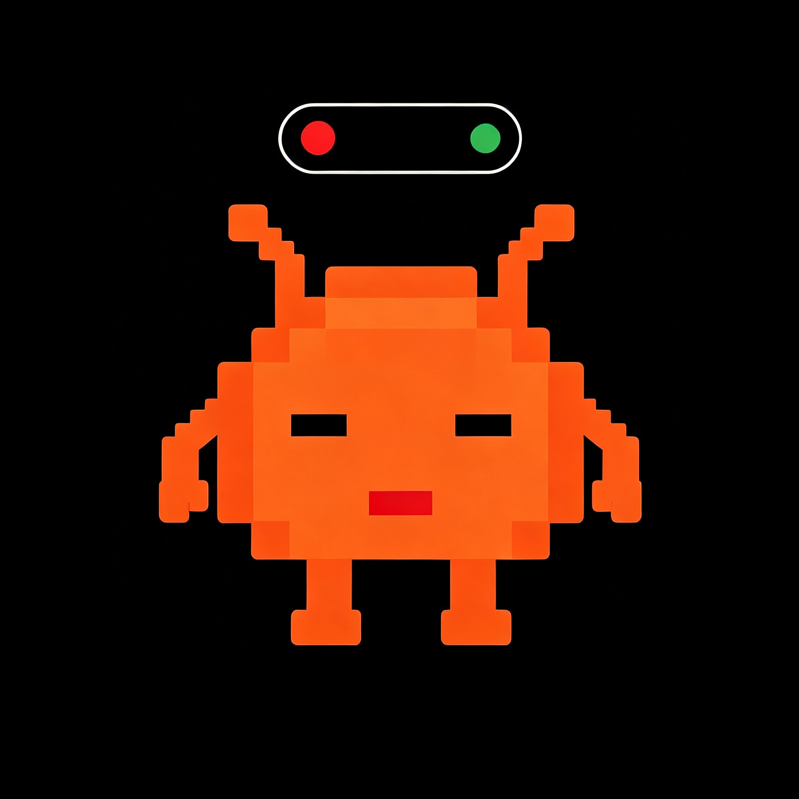
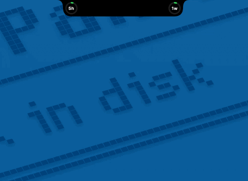
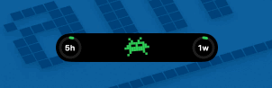
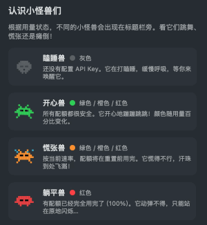

<p align="center">
  
</p>

<h1 align="center">ZBar</h1>

<p align="center">
  <strong>智谱编码套餐用量监控 — macOS 菜单栏工具</strong>
</p>

<p align="center">
  <a href="https://github.com/tankgit/ZhiPuMonitor/releases/latest">
    
  </a>
  
  
  
  
  
  
</p>

<p align="center">
  <a href="./README.md">English</a> · <a href="./README_zh.md">中文</a>
</p>

---

## 前言

这个项目诞生在去阿那亚玩的火车上。一路上 vibe coding，突然发现自己的智谱编码套餐快用完了——每次都得登录官网查用量，非常麻烦。市面上也没找到好用的智谱 Coding Plan 用量监控工具，于是顺手花了大半天 vibe 了一个出来。

后续没有大的迭代计划，但会基于这个项目开启一个更完善的新产品。

## 功能特性

- **刘海覆盖** — 在 MacBook 刘海区域直接显示用量环形指示器和像素风吉祥物。悬停查看百分比，点击展开完整监控面板。

- **离岛模式** — 在菜单栏下方显示浮动胶囊条，避免与其他刘海应用冲突。通过自定义全局快捷键切换（默认 `Ctrl`+`Option`+`0`）。

- **三配额卡片** — 5小时额度、一周额度、MCP 调用，各自带进度条、重置倒计时和安全预测。

- **用量安全预测** — 根据当前消耗速率计算配额是否会在下次重置前耗尽，显示 SAFE/ALARM 标记和预计剩余时间。

- **像素风吉祥物** — 动画像素小怪兽根据用量状态变化（开心 / 慌张 / 躺平 / 瞌睡），颜色随用量从绿色 → 橙色 → 红色渐变。

- **全局快捷键** — 通过 Carbon `RegisterEventHotKey` 注册系统级快捷键，无论当前使用什么应用都能响应。

- **右键菜单** — 在离岛模式视图上右键，快速切换胶囊显隐、打开设置或退出应用。

- **双语界面** — 完整支持中文和英文，可在设置中切换。

- **自动刷新** — 数据每 5 分钟自动刷新，也可手动刷新。

## 截图演示

### 刘海模式 — 悬停与展开

将鼠标悬停在刘海区域，实时查看各项配额的用量百分比。点击展开完整的监控面板，包含进度条、安全标记和动画吉祥物。



### 离岛模式 — 胶囊条

开启离岛模式后，菜单栏下方会出现浮动胶囊条，显示 5 小时和一周额度的环形指示器以及吉祥物，完全不与其他刘海应用冲突。


### 离岛模式 — 快捷键切换

按下自定义全局快捷键（默认 `Ctrl`+`Option`+`0`）即可瞬间显示或隐藏胶囊条，带有平滑滑动动画。系统全局可用，不受当前活跃应用影响。



### 吉祥物状态

像素风小怪兽会根据用量做出反应：安全时开心跳舞，接近阈值时满头大汗，耗尽时原地闪烁。颜色随用量从绿色 → 橙色 → 红色渐变。



## 下载安装

> **仅支持 Apple Silicon (M1/M2/M3/M4)** — 需要 macOS 13 Ventura 或更高版本。

### AI 辅助安装

复制下方 prompt 粘贴给任意 AI 助手（Claude、ChatGPT 等），它会一步步引导你完成安装：

```
Help me install ZBar, a macOS menu bar app. Read the instructions from this GitHub README and guide me step by step: https://github.com/tankgit/ZhiPuMonitor/blob/main/README.md
```

### 手动安装

从 [Releases](https://github.com/tankgit/ZhiPuMonitor/releases/latest) 页面下载最新版本，将 `ZBar.app` 拖入 `/Applications` 即可。

## 使用指南

### 1. 获取 API Key

你需要一个智谱（ZhiPu）API Key。如果还没有，请前往智谱平台获取。

### 2. 配置

点击展开面板中的齿轮图标，或在离岛胶囊上右键 → **设置**：

- 粘贴 API Key 并点击 **更新**
- 调整 **用量预警阈值**（橙色 / 红色）
- 如需避免刘海冲突，开启 **离岛模式**
- 自定义 **快捷键** 以切换胶囊显隐

### 3. 操作说明

| 操作 | 效果 |
|------|------|
| 悬停刘海 / 胶囊 | 显示用量百分比 |
| 点击刘海 / 胶囊 | 展开完整监控面板 |
| 按快捷键 | 显示 / 隐藏离岛胶囊 |
| 右键离岛视图 | 弹出菜单（切换、设置、退出） |

## 技术栈

- **语言：** Swift 5.9
- **UI 框架：** SwiftUI + AppKit (NSPanel, NSMenu)
- **快捷键：** Carbon `RegisterEventHotKey` 实现系统全局快捷键
- **架构：** MVVM，使用 `ObservableObject` / `@Published`
- **构建：** Swift Package Manager

## 许可证

本项目基于 [MIT License](LICENSE) 开源。
